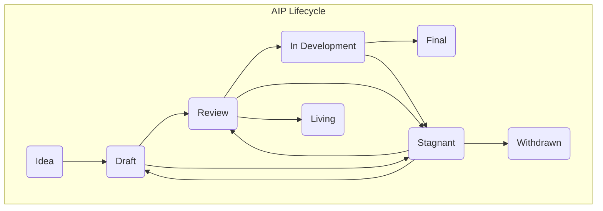

## Abstract

AIP stands for Allo Improvement Proposal. An AIP is a design document providing
information to the Allo community, or describing a new feature for Allo. The AIP
should provide a concise technical specification of the feature and a rationale
for the feature. The AIP author is responsible for building consensus within the
community and documenting dissenting opinions.

## Motivation

We intend AIPs to be the primary mechanisms for proposing new features, for
collecting community technical input on an issue, and for documenting the design
decisions that have gone into Allo. Because the AIPs are maintained as text
files in a versioned repository, their revision history is the historical record
of the feature proposal.

For the team of core contributors, AIPs are a convenient way to track the
progress of their implementation. Ideally each implementation maintainer would
list the AIPs that they have implemented. This will give end users a convenient
way to know the current status of a given implementation or library.

## Goals

<!--
This section is required.

The Goals section should explicitely state in a bulleted list the technical
goals that this AIP seeks to solve. The best code is no code, so what
goal(s) are we accomplishing by adding more code?

TODO: Remove this comment before submitting
-->

- To clarify the development and improvement process for the Allo Protocol

## Specification

### AIP Types

There are three types of AIPs:

- A **Core Track AIP** describes any change that affects the Allo Protocol smart
    contracts.
- A **Informational AIP** describes design patterns or general guidelines to
    the Allo community, but does not propose a new feature.
- A **Meta AIP** describes a process surrounding Allo Protocol or proposes
    a change to the AIP process. Examples include procedures, guidelines,
    changes to the decision-making process,and changes to the tools or
    environment used in Allo development. Any meta-AIP is also considered
    a Process AIP.

It is highly recommended that a single AIP contain a single key proposal or new
idea. The more focused the AIP, the more successful it tends to be.

An AIP must meet certain minimum criteria. It must be a clear and complete
description of the proposed enhancement. The enhancement must represent a net
improvement. The proposed implementation, if applicable, must be solid and must
not complicate the protocol unduly.

### AIP Work Flow

#### Shepherding an AIP

Parties involved in the process are you, the champion or *AIP author*, and the [*AIP
editors*](#eip-editors), and the Allo Protocol Core Developers.

Before you begin writing a formal AIP, you should vet your idea. Ask the Allo
community first in the Discussion on this repo if an idea is original to avoid
wasting time on something that will be rejected based on prior research. It is
thus recommended to open a discussion thread on [the Allo Discussion
forum](https://github.com/allo-protocol/aips/discussions/new/choose) to do this.

Once the idea has been vetted, your next responsibility will be to present (by
means of an AIP) the idea to the reviewers and all interested parties, invite
editors, developers, and the community to give feedback on the aforementioned
channels. You should try and gauge whether the interest in your AIP is
commensurate with the work involved in implementing it. Negative community
feedback will be taken into consideration and may prevent your AIP from moving
past the Draft stage.

#### AIP Process

The following is the standardization process for all AIPs in all tracks:

**Idea** - An idea that is pre-draft. This is not tracked within the AIP Repository.

**Draft** - The first formally tracked stage of an AIP in development. An AIP is
merged by an AIP Editor into the AIP repository when properly formatted.

**Review** - An AIP Author marks an AIP as ready for and requesting Peer Review.

**In Development** - In the lifecycle of an AIP, the stage of "In Development" represents a significant milestone indicating that an AIP has undergone the initial review process and is actively being worked on by its authors and contributors. After an AIP has been marked as ready for review by the AIP Author, it enters the "In Development" state.

**Final** - This AIP represents the final standard. A Final AIP exists in
a state of finality and should only be updated to correct errata and add
non-normative clarifications.

A PR moving an AIP from Last Call to Final SHOULD contain no changes other than
the status update. Any content or editorial proposed change SHOULD be separate
from this status-updating PR and committed prior to it.

**Stagnant** - Any AIP in `Draft` or `Review` or `Last Call` if inactive for
a period of 6 months or greater is moved to `Stagnant`. An AIP may be
resurrected from this state by Authors or AIP Editors through moving it back to
`Draft` or it's earlier status. If not resurrected, a proposal may stay forever
in this status.

**Withdrawn** - The AIP Author(s) have withdrawn the proposed AIP. This state
has finality and can no longer be resurrected using this AIP number. If the idea
is pursued at later date it is considered a new proposal.

**Living** - A special status for AIPs that are designed to be continually
updated and not reach a state of finality. This includes most notably AIP-1.

### What belongs in a successful AIP?

Each AIP should have the following parts:

**Preamble** - RFC 822 style headers containing metadata about the AIP, including the AIP number, a short descriptive title (limited to a maximum of 44 characters), a description (limited to a maximum of 140 characters), and the author details. Irrespective of the category, the title and description should not include AIP number. See [below](#aip-header-preamble) for details

**Abstract** - Abstract is a multi-sentence (short paragraph) technical summary. This should be a very terse and human-readable version of the specification section. Someone should be able to read only the abstract to get the gist of what this specification does.

**Motivation** *(optional)* - A motivation section is critical for AIPs that want to change the protocol. It should clearly explain why the existing protocol specification is inadequate to address the problem that the AIP solves.

**Goals** - A goals section should explicitly state in a bulleted list the
technical goals that the AIP seeks to solve.

**Non-goals** *(optional)* - If necessary, explain what goals this AIP specifically does not seek to solve. This is useful when a problem is closely related to the problem(s) identified earlier in the AIP. For any Non-goals, please clarify why they are not included in this AIP.

**Specification** - The technical specification should describe the code changes
that need to be made to the existing smart contracts to implement this AIP. The
should provide a detailed explanation for how this solves the problem identified
in the AIP.

**Reference Implementation** *(optional)* - The reference implementation should
include a minimal implementation that assists in understanding or implementing
this specification.

**Rationale** - The rationale fleshes out the specification by describing what motivated the design and why particular design decisions were made. It should describe alternate designs that were considered and related work, e.g. how the feature is supported in other protocols. The rationale should discuss important objections or concerns raised during discussion around the AIP

**References** *(optional)* - If applicable, the references section should list
any relevant external sources that help convey the problem or solution described
by the AIP.

**Copyright** Waiver - All AIPs must be in the public domain. The copyright waiver MUST link to the license file and use the following wording: `Copyright and related rights waived via [CC0](../LICENSE.md).`

### AIP Formats and Templates

AIPs should be written in [markdown](https://github.com/adam-p/markdown-here/wiki/Markdown-Cheatsheet) format. There is a [template](../template.md) to follow.

### AIP Header Preamble

Each AIP must begin with an [RFC 822](https://www.ietf.org/rfc/rfc822.txt) style
header preamble, preceded and followed by three hyphens (`---`). This header is
also termed ["front matter" by Jekyll](https://jekyllrb.com/docs/front-matter/).
The headers must appear in the following order.

`aip`: *AIP number* (this is determined by the AIP editor)

`title`: *The AIP title is a few words, not a complete sentence*

`status`: *Draft, Review, Last Call, Final, Stagnant, Withdrawn, Living*

`type`: *One of `Core`, `Meta`, or `Informational`*

`author`: *The list of the author's or authors' name(s) and/or username(s), or name(s) and email(s). Details are below.*

`created`: *Date the AIP was created on*

Headers that permit lists must separate elements with commas.

Headers requiring dates will always do so in the format of ISO 8601
(yyyy-mm-dd).

#### `author` header

The `author` header lists the names, email addresses or usernames of the
authors/owners of the AIP. Those who prefer anonymity may use a username only,
or a first name and a username. The format of the `author` header value must be:

> Random J. User &lt;address@dom.ain&gt;

or

> Random J. User (@username)

or

> Random J. User (@username) &lt;address@dom.ain&gt;

if the email address and/or GitHub username is included, and

> Random J. User

if neither the email address nor the GitHub username are given.

At least one author must use a GitHub username, in order to get notified on
change requests and have the capability to approve or reject them.

#### `type` header

The `type` header specifies the type of AIP: Core, Meta, or
Informational.

#### `created` header

The `created` header records the date that the AIP was assigned a number. Both
headers should be in yyyy-mm-dd format, e.g. 2001-08-14.

### Linking to External Resources

Other than the specific exceptions listed below, links to external resources
**SHOULD NOT** be included. External resources may disappear, move, or change
unexpectedly.

### Linking to other AIPs

References to other AIPs should follow the format `AIP-N` where `N` is the AIP
number you are referring to.  Each AIP that is referenced in an AIP **MUST** be
accompanied by a relative markdown link the first time it is referenced, and
**MAY** be accompanied by a link on subsequent references.  The link **MUST**
always be done via relative paths so that the links work in this GitHub
repository, forks of this repository, the main AIPs site, mirrors of the main
AIP site, etc.  For example, you would link to this AIP as `./aip-1.md`.

### Auxiliary Files

Images, diagrams and auxiliary files should be included in a subdirectory of the
`assets` folder for that AIP as follows: `assets/aip-N` (where **N** is to be
replaced with the AIP number). When linking to an image in the AIP, use relative
links such as `../assets/aip-1/image.png`.

### Transferring AIP Ownership

It occasionally becomes necessary to transfer ownership of AIPs to a new
champion. In general, we'd like to retain the original author as a co-author of
the transferred AIP, but that's really up to the original author. A good reason
to transfer ownership is because the original author no longer has the time or
interest in updating it or following through with the AIP process, or has fallen
off the face of the 'net (i.e. is unreachable or isn't responding to email).
A bad reason to transfer ownership is because you don't agree with the direction
of the AIP. We try to build consensus around an AIP, but if that's not possible,
you can always submit a competing AIP.

If you are interested in assuming ownership of an AIP, send a message asking to
take over, addressed to both the original author and the AIP editor. If the
original author doesn't respond to the email in a timely manner, the AIP editor
will make a unilateral decision (it's not like such decisions can't be reversed
:)).

### AIP Editors

The current AIP editors are

- Aditya Anand <aditya@gitcoin.co>
- Andrea Franz <andrea@gitcoin.co>
- Kurt Merbeth <kurt@gitcoin.co>
- Nate Gosselin<nate@gitcoin.co>
- Zakk Fleischmann <zakk@gitcoin.co>

### AIP Editor Responsibilities

For each new AIP that comes in, an editor does the following:

- Read the AIP to check if it is ready: sound and complete. The ideas must make technical sense, even if they don't seem likely to get to final status.
- The title should accurately describe the content.
- Check the AIP for language (spelling, grammar, sentence structure, etc.), markup (GitHub flavored Markdown), code style

If the AIP isn't ready, the editor will send it back to the author for revision,
with specific instructions.

Once the AIP is ready for the repository, the AIP editor will:

- Assign an AIP number (generally the PR number, but the decision is with the editors)
- Merge the corresponding [pull request](https://github.com/allo-protocol/aips/pulls)
- Send a message back to the AIP author with the next step.

Many AIPs are written and maintained by developers with write access to the Allo
codebase. The AIP editors monitor AIP changes, and correct any structure,
grammar, spelling, or markup mistakes we see.

### Style Guide

#### Titles

The `title` field in the preamble:

- Should not include the word "standard" or any variation thereof; and
- Should not include the AIP's number.

## References

This document was derived heavily from [Ethereum's EIP-1](), which in run was
derived heavily from [Bitcoin's BIP-0001](https://github.com/bitcoin/bips),
which in turn was derived from [Python's PEP-0001](https://peps.python.org/). In
many places text was simply copied and modified.

## Copyright

Copyright and related rights found in [LICENSE](./LICENSE).

